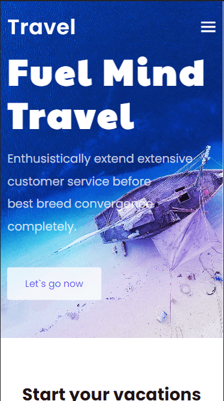

# My_Travel-website



## About
A Travel website with complete responsive features and modern UI using HTML and CSS and some JavaScript 


## Usage

### Using via CSS

1. Include the stylesheet on your document's `<head>`

```html
<head>
  <link rel="stylesheet" href="boxicons.min.css">
</head>
```

Instead of installing you may use the remote version 

```html
<head>
  <link rel="stylesheet"
  href="https://cdn.jsdelivr.net/npm/boxicons@latest/css/boxicons.min.css">
  <!-- or -->
  <link rel="stylesheet"
  href="https://unpkg.com/boxicons@latest/css/boxicons.min.css">
</head>
```
2. To use an icon on your page, add a class 'bx' and seperate class with the icons name with a prefix 'bx-' for regular icons , 'bxs-' for solid icons and 'bxl-' for logos:

```html
<i class="bx bx-hot"></i>
<i class="bx bxs-hot"></i>
<i class="bx bxl-facebook-square"></i>
